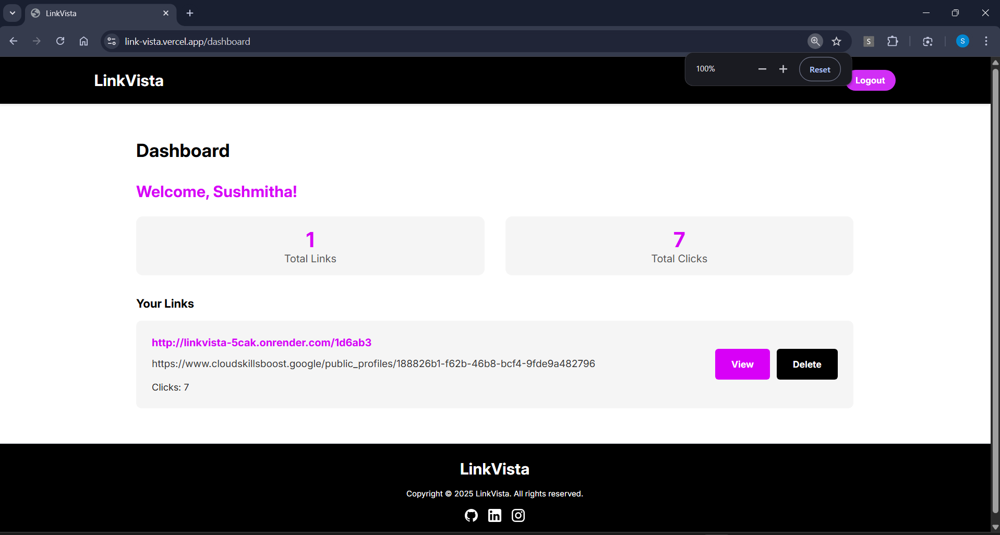

# LinkVista – Smart URL Shortener with QR Code & Analytics

[Live App](https://link-vista.vercel.app/)

LinkVista is a fullstack URL shortener built with React, Node.js, and MongoDB that lets users generate short, shareable links along with auto-generated QR codes. It also provides visual analytics such as device type, click count, and location using an intuitive dashboard.

---

## 🚀 Features

- 🔐 **User Authentication** – JWT-based secure login/register system
- 🔗 **URL Shortening** – Generate short URLs instantly
- 📱 **QR Code Generator** – Downloadable QR codes for every link
- 📊 **Analytics Dashboard** – View clicks, device types, and location data
- 🧭 **Location Tracking** – Real-time IP-based location using [ip-api.com](http://ip-api.com)
- 📈 **Charts** – Pie charts and line graphs for visualizing data (Chart.js)
- 🗑️ **Delete Links** – Easily delete links from your dashboard
- 🔒 **Private Dashboard** – Only the logged-in user can view and manage their links

---

## 🎯 Objectives

- Build a clean, secure fullstack URL shortener
- Enable QR code generation
- Track and visualize real-time analytics
- Provide a personalized dashboard
- Deploy for public access and usability

---

## 🛠️ Tech Stack

| Layer            | Technologies Used                   |
| ---------------- | ----------------------------------- |
| **Frontend**     | React, React Router, Axios          |
| **Backend**      | Node.js, Express.js                 |
| **Database**     | MongoDB, Mongoose                   |
| **Auth**         | JWT, bcryptjs                       |
| **Charts**       | Chart.js, react-chartjs-2           |
| **QR Code**      | qrcode (Node package)               |
| **Location API** | ip-api.com                          |
| **Hosting**      | Vercel (Frontend), Render (Backend) |

---

## 📷 Screenshots

| Feature        | Screenshot                                            |
| -------------- | ----------------------------------------------------- |
| Landing Page   |             |
| Features       |                |
| FAQs           |                        |
| Login Page     |                 |
| Signup Page    |               |
| User Dashboard |     |
| Link Details   |  |

---

## ⚙️ How It Works (Backend Logic)

1. User enters a URL and clicks **Shorten**.
2. A `shortCode` is generated and stored along with metadata.
3. A QR code is generated using the `qrcode` package.
4. When someone visits the short link:
   - The app logs the device type using `User-Agent`.
   - It fetches location using `ip-api.com`.
5. Analytics data is stored and displayed on the Link Details page via charts.

---

## 🔐 Authentication

- Passwords are hashed using `bcryptjs`.
- Tokens are generated using `JWT` and stored in local storage for session handling.

---

## 📦 Installation (for local setup)

```bash
# Clone the repository
git clone https://github.com/sushmithashettigar29/LinkVista

# Navigate to frontend and install dependencies
cd client
npm install

# Navigate to backend and install dependencies
cd ../server
npm install

# Create a .env file in backend with MongoDB URI and JWT secret
MONGO_URI=your_mongodb_uri
JWT_SECRET=your_jwt_secret
PORT=your_port_number

# Run backend
npm start

# Run frontend
cd ../client
npm run dev

```

## 📝 License

This project is licensed under the **MIT License**.
Feel free to use, modify, and distribute for personal and commercial purposes.

---

## 🙌 Contribution

Contributions, issues, and feature requests are welcome!
Feel free to fork this repo and submit a pull request.

---

## 💬 Contact

Created with ❤️ by Sushmitha Shettigar
Reach out via [LinkedIn](https://www.linkedin.com/in/sushmithashettigar/) or [GitHub](https://github.com/sushmithashettigar29)
```
